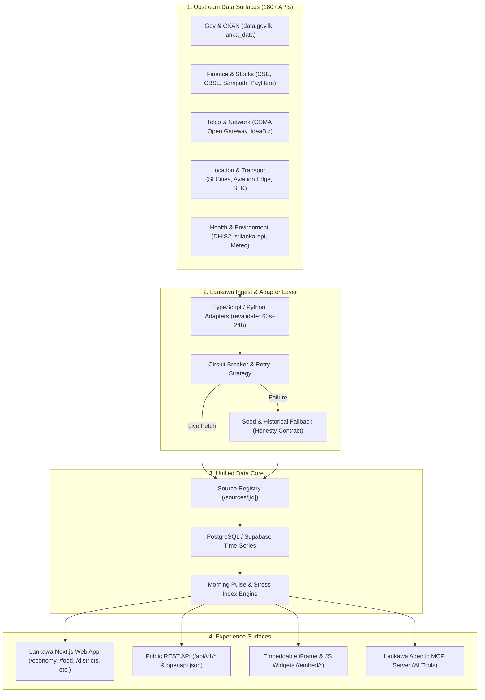
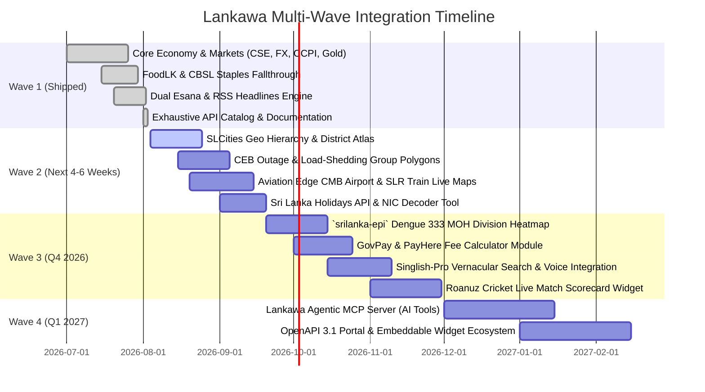

# Lankawa Master API Integration Architecture & Roadmap

A comprehensive, phased architecture for implementing, iterating, and utilizing the 180+ Sri Lanka API catalog inside Lankawa across UI surfaces, background ingestion pipelines, API endpoints, and AI agent capabilities.

---

## 1. System Integration Architecture

Lankawa uses a 4-tier modular architecture designed to consume diverse upstream APIs (REST, CKAN, ArcGIS, GraphQL, scrapers) while maintaining strict **freshness SLAs**, **provenance transparency**, and **zero-downtime graceful fallbacks**.

---

## 2. Sector-by-Sector Implementation Blueprint

| Sector | Primary APIs & Sources | Lankawa UI Surface | Ingest & API Strategy | Fallback / Seed |
| :--- | :--- | :--- | :--- | :--- |
| **1. News & Media** | Hiru News API, Esana v3 (`ThaminduDisnaZ` + `Damantha126`), Ada Derana, RSS feeds (Daily Mirror, FT, Sunday Times) | `/news`, Home Pulse `news_headlines` | Server fetch with 30m revalidate; dual Esana endpoint failover; deduplicated title matching | `ingest/output/sl_news.json` cache |
| **2. Government Open Data** | `data.gov.lk` CKAN, `data.health.gov.lk`, `@nuuuwan/lanka_data`, ECLK Election API | `/civic/[slug]`, `/elections`, `/sources` | CKAN `package_search` + datastore queries; `lanka_data` HTTP proxy for demographic maps | Static Census 2024 & Election 2024 seed JSON |
| **3. Financial & Markets** | CSE `cse.lk/api/` (ASPI, S&P SL20), CBSL TT rates, Fawaz USD/LKR, World Bank LKA, Gold troy-oz | `/economy`, Home Pulse `cse_aspi` | 30s market-hours polling for CSE; daily FX & gold pawn conversion (`src/lib/gold-pawn.ts`) | Static market snapshot & seed FX series |
| **4. Telecom & Network** | GSMA Open Gateway (Dialog, SLT-Mobitel, Hutch, Airtel), Text.lk, Notify.lk | `/services` (OTP & carrier billing options for partner checkout) | Standard CAMARA NaaS API endpoints; webhook callbacks for 2FA | Fallback to SMS OTP gateways |
| **5. Payments & GovPay** | GovPay (`govpay.lk`), PayHere, LankaPay JustPay Web, WEBXPAY | `/services`, `/developers` | Transparent fee calculator for 3,372 government services; PayHere checkout SDKs | Manual payment portal links |
| **6. Transport & Aviation** | Sri Lanka Railways Location API, Aviation Edge CMB/VCBI, SAGT e-Port, Customs ASYHUB | `/transport` | Flight timetable polling (`iataCode=CMB`); train GPS polling; container milestone tracking | Static train/flight timetable directory |
| **7. Location & Geo** | `slcities.live/api`, `location-api-sl`, OSM MapTiler, Postal Code decoders | `/districts/[slug]`, `/provinces/[slug]`, Assistant | Proximity lookup (`/cities/nearby`), postcode search, trilingual city resolution | `src/data/districts.json` seed |
| **8. Weather & Disaster** | Dept of Meteorology ArcGIS REST, Open-Meteo, OpenAQ, DMC CAP feed, USGS Earthquakes | `/disaster`, Home Pulse `weather_colombo` | Open-Meteo 30m forecast model; USGS 10m quake filter; DMC CAP hazard alerts | `open_meteo` fallback |
| **9. Health & Surveillance** | `srilanka-epi` PyPI, `lk_dengue` NDCU scraper, DHIS2 FHIR Gateway | `/health` | Weekly Epidemiological Report (WER) PDF ingest → 333 MOH dengue/lepto division rates | `src/data/dengue-seed.json` |
| **10. Education & EdTech** | BrainUs AI API, BrainyBoost, API Learning 101 | `/learn`, Assistant RAG | National Curriculum textbook RAG integration for GCE A/L & O/L assistant queries | Static syllabus catalog |
| **11. Tourism & Hospitality** | Travora 2.0 API, SLTDA datasets, PearlPath API, ZentrumHub | `/explore` (Attractions & certified stays) | SLTDA provider list parsing; ZentrumHub hotel inventory normalizer | Static tourism seed |
| **12. Language & Vernacular** | `sinhala-unicode-converter`, `singlish-pro`, Google Speech `si-LK`/`ta-LK`, Akuru GEN | Assistant, Search inputs, Header locale toggle | Real-time in-browser Singlish-to-Sinhala transliteration; trilingual UI text | Fallback to raw English text |
| **13. Sports & Cricket** | Roanuz Cricket GraphQL (`sports.dev.roanuz.com`), CricAPI, Cricsheet ball-by-ball | Home Pulse `cricket_card` | GraphQL ball-by-ball polling for Sri Lanka national team & LPL matches | Static match schedule |
| **14. Citizen Identity & Holidays** | Sri Lanka Holidays API (`srilanka-holidays.vercel.app`), SL NIC API decoder | `/services`, `/brief/[date]` | Holiday calendar fetch (`GET /api/v1/holidays`); in-browser NIC format decoder (DOB/gender/voter) | CBSL gazette 2026 holiday seed |
| **15. Utilities & Energy** | CEB Care Incognito OutageMap (`cebcare.ceb.lk`), FuelPass quota, CPC/Lanka IOC prices | `/economy`, `/disaster`, Home Pulse `power_status` | Incognito Selenium/HTTP scrape for CEB load-shedding letter groups (A–Y); CPC fuel rates | `src/lib/fuel.ts` static CPC prices |
| **16. International Data** | World Bank WDI, UN Comtrade / WITS, FAOSTAT, ReliefWeb | `/economy`, `/environment` | Weekly WDI GDP/CPI fetch; FAO paddy/tea crop statistics; ReliefWeb crisis reports | Seed indicators |

---

## 3. Phased Iteration Roadmap

---

## 4. Key Implementation Standards

1. **Honesty & Provenance First**:
   - Every metric displayed in Lankawa must specify its `sourceId`, `sourceName`, and link to `/sources/[id]`.
   - Never invent live numbers: when an API is unreachable, fall back to seed data with explicit UI disclaimers (e.g. `"Seed fallback — live API unavailable"`).

2. **Performance & Rate Limit Protection**:
   - All external API calls must be wrapped with an `AbortController` timeout (5s–10s max).
   - Use Next.js `fetch` caching (`next: { revalidate: seconds }`) to protect third-party endpoints.
   - For high-frequency endpoints (CSE, News), use server-side background ingestion workers to populate PostgreSQL/JSON caches.

3. **Singlish & Trilingual Accessibility**:
   - Embed `singlish-pro` / `sinhala-unicode-converter` in search bars and assistant inputs so users can type `colombo weather` or `kolamba kaalagunaya` and get instant localized results.

4. **Agentic MCP Readiness**:
   - Expose all integrated datasets as structured Model Context Protocol (MCP) tools so AI assistants (Claude, Antigravity) can query Lankawa's live Sri Lankan data context seamlessly.
